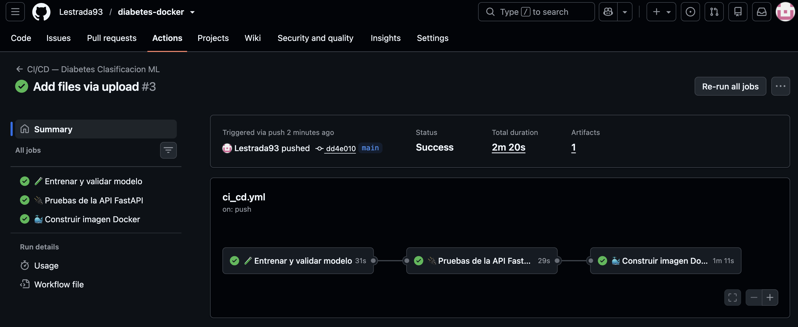
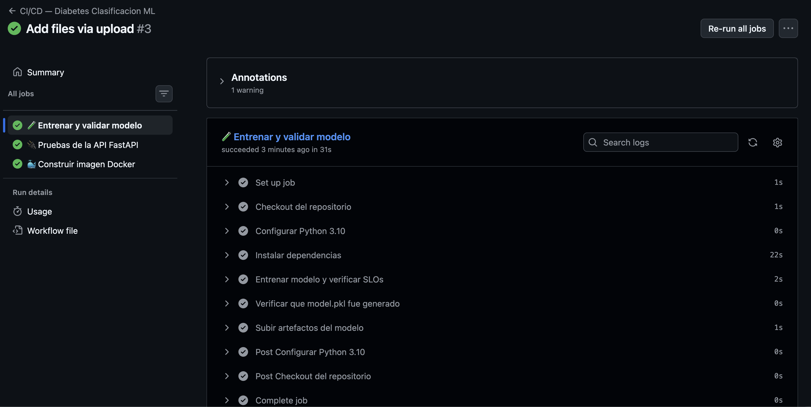
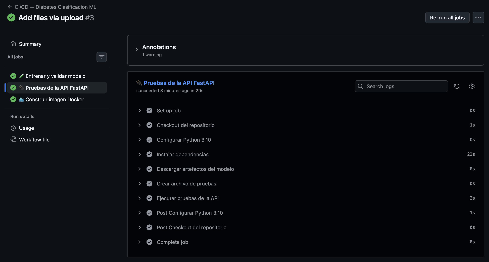
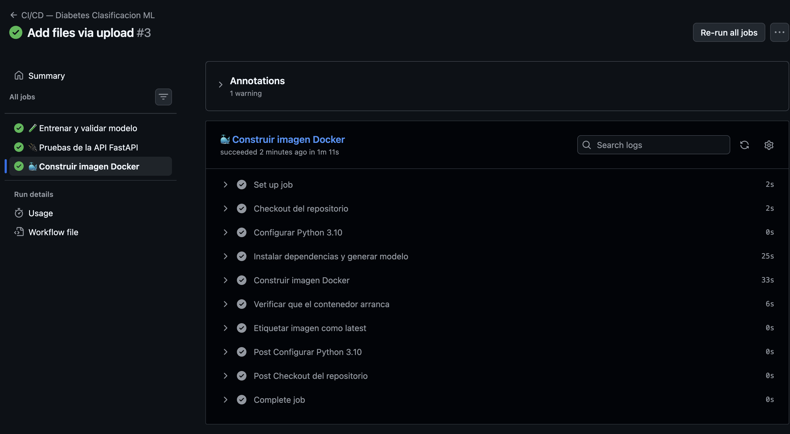
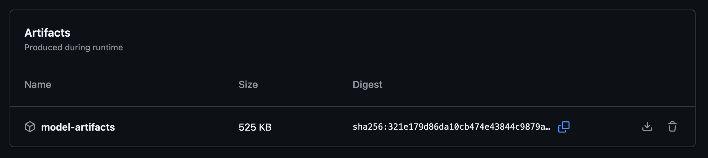

# 🐳 Predicción de Diabetes — Despliegue con Docker y FastAPI

**Gestión de Proyectos de Inteligencia Artificial — Universidad Tecmilenio**  
**Autor:** Luis Alonso Estrada Uribe  
**Modelo:** Random Forest · Dataset Pima Indians Diabetes  
**Fase:** II — Ejecución (Contenerización y Despliegue)

---

## 📋 Descripción del Proyecto

Esta fase implementa el despliegue completo del modelo de clasificación de diabetes desarrollado en la Fase I. El modelo Random Forest entrenado es expuesto mediante una **API REST con FastAPI**, contenerizado con **Docker** y accesible a través de una interfaz web integrada.

### Arquitectura del sistema

```
Usuario (navegador)
       ↓
  Frontend Web (HTML/JS)
       ↓
  FastAPI (app.py) — Puerto 8000
       ↓
  scaler.pkl → model.pkl
       ↓
  Predicción de diabetes
```

### Endpoints disponibles

| Método | Endpoint | Descripción |
|--------|----------|-------------|
| GET | `/` | Interfaz web para predicción |
| GET | `/health` | Estado del servicio |
| POST | `/predict` | Predicción de diabetes |
| GET | `/docs` | Documentación Swagger |

---

## 📁 Estructura del Repositorio

```
diabetes-docker/
├── .github/
│   └── workflows/
│       └── ci_cd.yml       # Pipeline CI/CD automatizado
├── app.py                  # API FastAPI + frontend web
├── train_model.py          # Script de entrenamiento del modelo
├── test_api.py             # Pruebas automatizadas de la API
├── model.pkl               # Modelo Random Forest entrenado
├── scaler.pkl              # StandardScaler ajustado
├── requirements.txt        # Dependencias Python
├── Dockerfile              # Configuración del contenedor
├── .dockerignore           # Archivos excluidos del contenedor
└── evidencias/
    ├── frontend.png
    ├── swagger_docs.png
    ├── swagger_home.png
    ├── swagger_health.png
    ├── swagger_predict.png
    ├── prueba_alto_riesgo.png
    ├── prueba_bajo_riesgo.png
    ├── docker_build_run.png
    ├── github_actions_success.png
    ├── github_actions_job1_modelo.png
    ├── github_actions_job2_tests.png
    ├── github_actions_job3_docker.png
    └── github_actions_artifacts.png
```

---

## ⚙️ Requerimientos Técnicos

| Herramienta | Versión |
|-------------|---------|
| Python | 3.10 |
| Docker Desktop | 24.0+ |
| numpy | 1.26.4 |
| scikit-learn | 1.4.2 |
| fastapi | 0.111.0 |
| uvicorn | 0.29.0 |
| pandas | 2.2.2 |

---

## 🚀 Manual de Despliegue Local

### Paso 1 — Clonar el repositorio

```bash
git clone https://github.com/Lestrada93/diabetes-docker.git
cd diabetes-docker
```

### Paso 2 — Generar el modelo entrenado

```bash
pip install -r requirements.txt
python train_model.py
```

Esto genera `model.pkl` y `scaler.pkl` en la misma carpeta.

### Paso 3 — Construir la imagen Docker

```bash
docker build -t diabetes-clasificacion-ml .
```

### Paso 4 — Ejecutar el contenedor

```bash
docker run -p 8000:8000 diabetes-clasificacion-ml
```

### Paso 5 — Abrir en el navegador

| URL | Descripción |
|-----|-------------|
| `http://localhost:8000` | Interfaz web |
| `http://localhost:8000/docs` | Documentación Swagger |
| `http://localhost:8000/health` | Estado del servicio |

---

## 🔄 Pipeline CI/CD (GitHub Actions)

El repositorio cuenta con un pipeline de integración y despliegue continuo que se ejecuta automáticamente en cada push a `main`. Está definido en `.github/workflows/ci_cd.yml` y consta de 3 jobs que corren en secuencia:

### Flujo del pipeline

```
Push a main
     ↓
Job 1: Entrenar y validar modelo
  - Instalar dependencias
  - Entrenar Random Forest
  - Verificar SLOs (recall ≥ 0.80)
  - Verificar artefactos generados
  - Subir model.pkl y scaler.pkl
     ↓
Job 2: Pruebas de la API FastAPI
  - Descargar artefactos del modelo
  - Ejecutar 7 pruebas automatizadas
     ↓
Job 3: Construir imagen Docker
  - Build de la imagen
  - Verificar que el contenedor arranca
  - Etiquetar imagen como latest
```

### Pruebas automatizadas incluidas

| Prueba | Descripción |
|--------|-------------|
| `test_health` | Verifica endpoint `/health` |
| `test_home` | Verifica que el frontend carga |
| `test_predict_alto_riesgo` | Caso clínico con diabetes |
| `test_predict_bajo_riesgo` | Caso clínico sin diabetes |
| `test_predict_campos_completos` | Verifica estructura de respuesta |
| `test_predict_caso_extremo_ceros` | Valores mínimos |
| `test_predict_caso_extremo_valores_altos` | Valores máximos |

Para ejecutar las pruebas localmente:

```bash
pip install pytest httpx
pytest test_api.py -v
```

### Evidencia del pipeline

#### Pipeline completo — Success



#### Job 1 — Entrenar y validar modelo



#### Job 2 — Pruebas de la API FastAPI



#### Job 3 — Construir imagen Docker



#### Artefactos versionados del modelo



---

## 🖥️ Evidencia de Despliegue

### Construcción y ejecución del contenedor


### Interfaz web


### Documentación API (Swagger)


---

## 🧪 Validación y Pruebas

### Casos de prueba evaluados

#### Caso 1 — Alto Riesgo de Diabetes

| Variable | Valor |
|----------|-------|
| Pregnancies | 6 |
| Glucose | 148 |
| BloodPressure | 72 |
| SkinThickness | 35 |
| Insulin | 0 |
| BMI | 33.6 |
| DiabetesPedigreeFunction | 0.627 |
| Age | 50 |

**Resultado:** `prediccion: 1 · probabilidad: 0.3664 · riesgo: Alto`


#### Caso 2 — Bajo Riesgo de Diabetes

| Variable | Valor |
|----------|-------|
| Pregnancies | 1 |
| Glucose | 85 |
| BloodPressure | 66 |
| SkinThickness | 29 |
| Insulin | 0 |
| BMI | 26.6 |
| DiabetesPedigreeFunction | 0.351 |
| Age | 21 |

**Resultado:** `prediccion: 0 · probabilidad: 0.0501 · riesgo: Bajo`


#### Caso 3 — Caso extremo (valores en cero)

Se probó con todos los valores en 0 para verificar que la API maneja correctamente valores límite sin errores. El modelo respondió con probabilidad mínima y clasificación de Bajo Riesgo, confirmando robustez ante entradas extremas.

### Endpoint /health

El endpoint de salud confirma que el servicio está activo y el modelo cargado correctamente:

```json
{
  "status": "ok",
  "modelo": "RandomForest",
  "umbral": 0.2
}
```


### Conclusiones de las pruebas

- La API responde correctamente a todos los casos evaluados con código HTTP 200.
- El umbral optimizado de 0.20 permite detectar casos de riesgo con probabilidades bajas, priorizando el recall clínico.
- La interfaz web comunica correctamente con el backend en todos los escenarios probados.
- El contenedor Docker es estable y reproducible en entorno local.
- El pipeline CI/CD garantiza que cada cambio en el código pasa por validación automática antes de ser desplegado.

---

## ☁️ Estrategia de Despliegue en la Nube

### Opción recomendada: Railway o Render (PaaS)

Para un despliegue sencillo y gratuito, se recomienda usar **Railway** o **Render**, que soportan despliegue directo desde GitHub con Docker.

**Pasos generales:**

1. Subir el repositorio a GitHub
2. Conectar la cuenta de Railway/Render con GitHub
3. Seleccionar el repositorio y detectará el `Dockerfile` automáticamente
4. Configurar el puerto `8000`
5. Desplegar — la plataforma construye y sirve el contenedor

### Opción alternativa: AWS / GCP / Azure

Para entornos empresariales se puede usar:
- **AWS ECS** (Elastic Container Service) con Fargate
- **Google Cloud Run** — serverless, escala automáticamente
- **Azure Container Apps**

En cualquier caso el flujo es:
```
Dockerfile → Imagen Docker → Docker Hub / Container Registry → Servicio en la nube
```

### Requerimientos técnicos para la nube

- Puerto expuesto: `8000`
- Memoria mínima recomendada: `512 MB`
- CPU: `0.5 vCPU`
- Variables de entorno: ninguna requerida (modelo incluido en la imagen)

---

## 🤝 Contribuciones y Dinámica de Trabajo

Proyecto desarrollado individualmente por **Luis Alonso Estrada Uribe** como parte de la Fase II y III del proyecto integrador de la materia Gestión de Proyectos de Inteligencia Artificial.

El desarrollo siguió el flujo:
1. Entrenamiento del modelo (continuación de Fase I)
2. Implementación de la API con FastAPI
3. Diseño del frontend integrado
4. Contenerización con Docker
5. Pruebas funcionales y de casos extremos
6. Pipeline CI/CD con GitHub Actions
7. Documentación del proceso

---

*Universidad Tecmilenio — Gestión de Proyectos de Inteligencia Artificial*
